# 1、冯·诺依曼机

## 概念

匈牙利计算机科学家——冯诺依曼提出了冯诺依曼机的概念：

- **计算机由五大部分组成**：
  - **控制器；**
  - **运算器；**
  - **存储器；**
  - **输入设备；**
  - **输出设备；**
- 指令和数据都需要存放到存储器当中且以同等地位存在，可按照地址寻访；
- 指令和数据用二进制表示；
- 指令由操作码和地址码组成：
  - 操作码：存放该指令的功能，比如加法还是减法；
  - 地址码：存放该指令所存放的数据或者数据所在地址；
- 以运算器为中心；

**冯·诺依曼机示例图如下**：

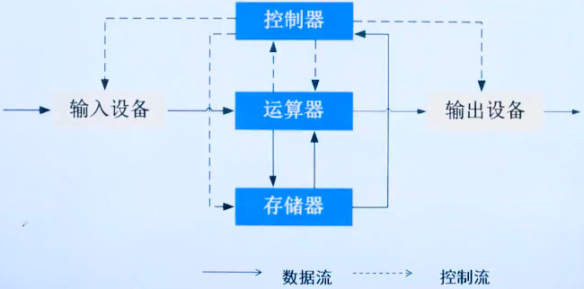

运算器：做算数运算（加减乘除）和逻辑运算（与或非）；

存储器：存储计算机的指令和数据；

控制器：指挥计算机做出相应的运算；

输入设备：将现实世界的信息转换成计算机能够识别的形式

输出设备：与输入设备功能相反；

存在的缺陷：以运算器为中心，因为计算机每个组件都需要和运算器做交互。

## 与现代计算机的区别

现在计算机整体架构示例图如下：

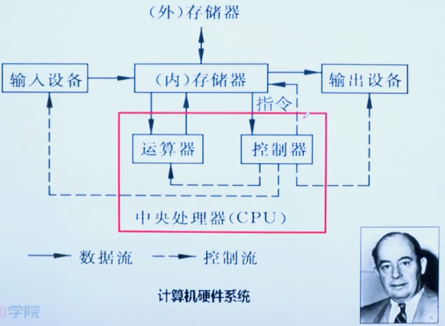

**相比于冯·诺依曼机，现代计算机将运算器和控制器相结合组成中央处理器（CPU），然后从以运算器为中心转变为以存储器为中心**，但是现代计算机是建立在冯·诺依曼机的基础之上的；

# 2、现代计算机和CPU

现代计算机硬件图如下：

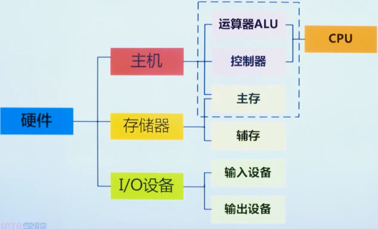

指令在早期现代计算机中的执行过程：

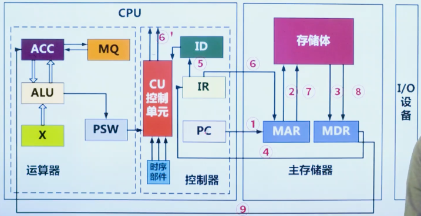

一些重要组件和特点介绍：

- 早期现代计算机中两个特殊部件：

  - MAR：内存地址缓冲寄存器，负责存放指令的内存地址，用它作为CPU和存储体之间的缓存是因为CPU的计算速度是远远大于存储体的，早期现代计算机的MAR是存放在主存储器中，现在已经集成进入了CPU中；
  - MDR：内存数据缓冲寄存器，负责存放数据的内存地址，用它作为CPU和存储体之间的缓存是因为CPU的计算速度是远远大于存储体的，早期现代计算机的MDR是存放在主存储器中，现在已经集成进入了CPU中；

- 现代计算机组件：

  - 运算器组件：
    - ALU：算术逻辑单元，负责算数运算和逻辑运算；
    - ACC：累加寄存器，是一个通用寄存器，为ALU提供一个工作区，用来暂存数据；
    - DR：数据缓冲寄存器（非早期现代计算机中MDR集成到了CPU中形成了DR）,主要负责写内存时，暂存指令或数据；
    - PSW：状态寄存器，负责存储溢出、中断等状态标志和控制标志；
  - 控制器组件：
    - CU：控制单元；
    - PC：程序计数器，负责存储下一条指令所在的内存单元地址；
    - IR：指令寄存器，负责存放从内存中取出的即将执行的指令；
    - ID：指令译码器，负责解释指令，将操作码和地址码分开；
    - AR：地址缓冲寄存器（非早期现代计算机中MAR集成到了CPU中形成了AR），主要负责保存当前CPU所访问的内存单元的地址。
  - 时序部件：负责控制计算机什么时候干什么事；

- 算数运算中需要用到的一些CPU寄存器：

  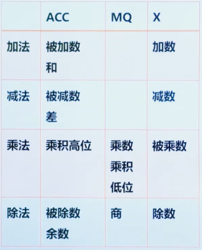

- 计算机中做运算时如何做判断运算动作的呢？是根据指令判断的，译码器先将二进制指令翻译成要做的运算动作，然后再进行运算：

  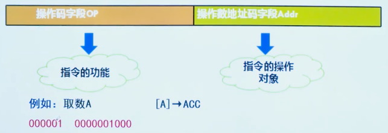

- 现在计算机中一条指令执行的过程：取址 ==> 分析 ==> 执行

  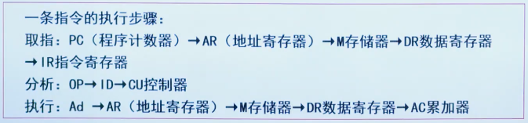

## 历年真题

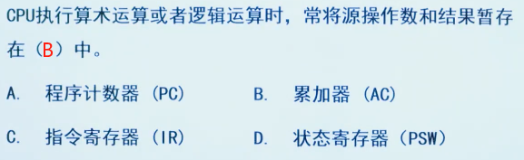

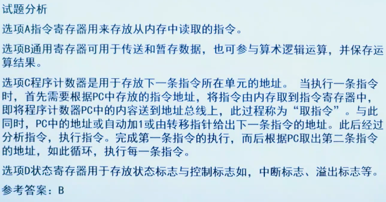

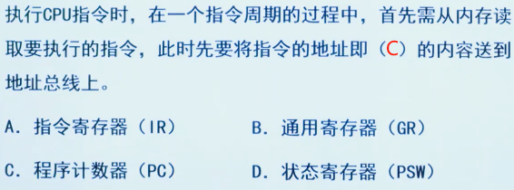

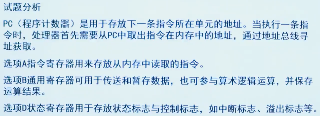

# 3、存储器

## 主存

主存是存储器中最值得提及的一部分，下面存储器也是以主存为例作出的介绍；

存储器的基本单元是**存储单元**，这个是由晶片构成，存储单元一般以**8位二进制**作为一个存储单元，也就是**8 bit（1字节）**的存储大小，每个存储单元都有一个地址，一般来说地址都用**十六进制数**进行表示，例如 `0x0077ffc6` 或者 `A4000H` 的形式；

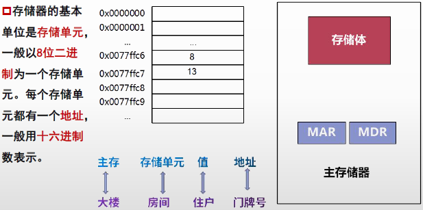

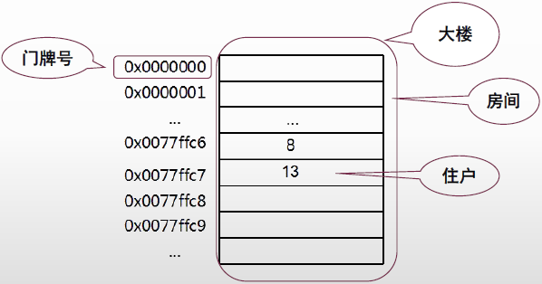

下面显示的就是地址总线和数据总线的介绍和计算基础：

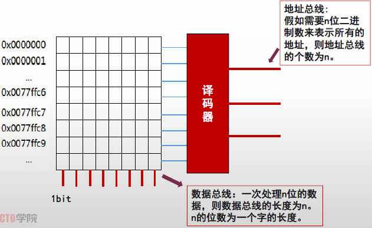

注意：

- 地址总线并不是有多少地址就有多少地址总线，它是按照地址的数量转换成二进制数取其位数换算的，例如有一个内存地址数量只有8，那么地址总线数量就为3（2^3=8）；
- 数据总线需要注意的是平时说的32位和64位机，指的是一次能够处理32位和64位比特长度的数据，而它们的字长分别是32位和64位；

**计算例题如下：**

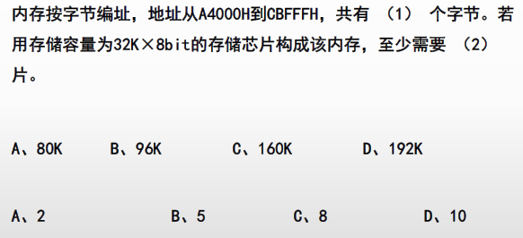

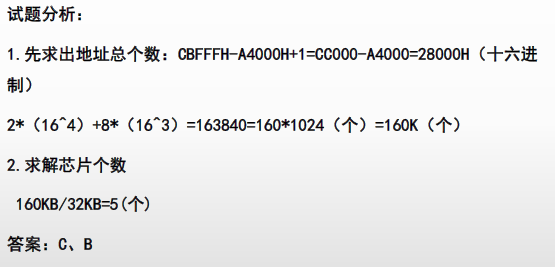

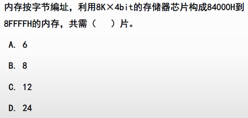

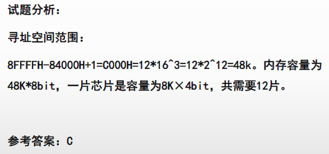

## 存储器的分类
